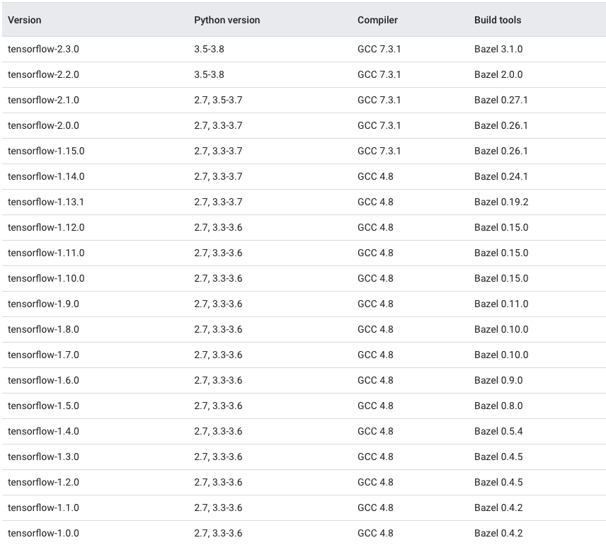
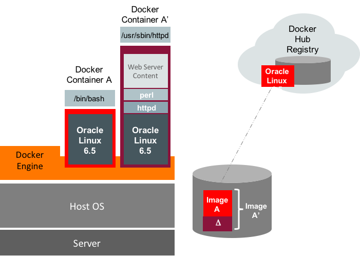
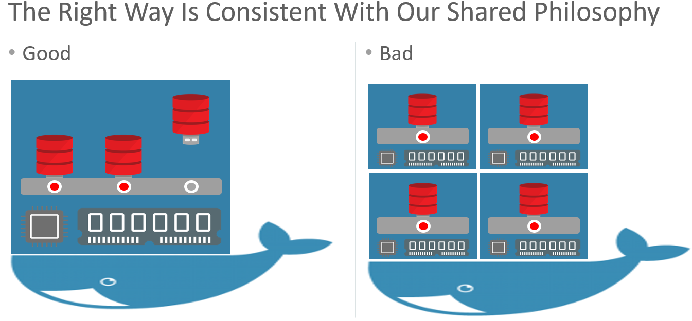

## What is Docker?

**Docker** is a software development platform for virtualization with multiple Operating systems running on the same host. It helps to separate infrastructure and applications in order to deliver software quickly. Unlike Hypervisors, which are used for creating VM (Virtual machines), virtualization in Docker is performed on system-level, also called Docker containers.

As you can see the difference in the image below, Docker containers run on top of the host's Operation system. This helps you to improves efficiency and security. Moreover, we can run more containers on the same infrastructure than we can run Virtual machines because containers use fewer resources.

[](https://www.guru99.com/images/1/101818_0504_DockerTutor1.png)

## Virtualization in Docker vs Hypervisor

Unlike the VMs which can communicate with the hardware of the host (ex: Ethernet adapter to create more virtual adapters) Docker containers run in an isolated environment on top of the host's OS. Since Oracle prefers to run its products in Oracle Lunix, installing docker in Oracle Linux is preferable. You also can use Oracle slim set of libraries with each docker application to ensure you have the bacis O.S libraries that Oracle requires to run its products. ( more details in the workshop)


## Q: Does that mean, we can get rid of VM's.

A: No,.We can run a VM  with docker engine installed. Since you can install multiple isolated application within each Docker container within the same VM, you might have to create fewer VM images. Also, you can scale VM  vertically to increase /decrease CPUs and  intern allow optimizing the workload on the server.

## Q: Why use Docker at all !!

A:  Image you need to run a  python application and connect to a Backend database and frontend React JS application. As a developer, you will have to ensure that you install the right version of O.S, Python, and the validated version of database drivers. You have to ensure that all the backend is compatible with front end.  Next, a system administrator has to understand the installation process in development and test the install in UAT and then in production. -- There is a lot of  time and resources used to ensure that compatibility and of application, the version of libraries and underlying O.S version are all exactly the same so that you can  deploy successfully. You can say, there is some flexibility with VMs, but as mentioned earlier, they take up a lot of time and resources to test this and also susceptible to human errors. Also, You cannot control a linux server environment change over time due to adding or upgrading some libraries that could parentally conflict with the application being run.

Below is a sample of application matrix between application, O.S, Python libraries, and Compiler versions. This could get further complicated when the application depends on another application like streams, memory cache to run it. Having a docker image with the required libraries and tested during creation of a docker image will ensure that you will get the same set of libraries, when anywhere you run that Docker image.   



## Q: Why is Docker containers considered lighter than VMs.

A: A docker application depends heavily on the libraries of the O.S where its installed to do most of the work. So, in linux environments like Oracle Linux, Ubuntu, Redhat, etc, We have a set of libraries slightly different in each of them, but the underlying O.S will be the same. These different set of libraries like Oracle-slim ( 300MB in size) is what we recommend to install along with the application to run in Oracle Linux environment.  



As an example, above figure depicts a container image created on the local host by pulling an Oracle Linux 6.5 image  ( oraclelinux:6-slim) from the Docker Hub Registry. The following docker run command runs the base Oracle Linux 6.5 image as a container named ContainerA.

Now the administrator can add a layer by installing Apache web server packages and web server content. Once the container is installed and configured, the configuration can be committed generating a new Docker image named ContainerAprime.


## Q: Can we have Oracle Database as a Docker Application.

A : Yes, you can. However, for production environments that needs scalability, performance, high availability, it is recommended to run the DB on a separate server and connect to the middle tier which in Docker. Unlike most of the database, Oracle Database has scalability, performance, availability and consolidated features of several specialized database like JSON DB, XML DB, Graph DB, spatial and analytical DB, Memory Cache, InMemory DB, ML DB , etc. Oracle even provides Oracle database images or dockerfiles to quickly run it as a application..

Oracle pluggable database features like isolation, rapid cloning, easy upgrades compliments Applications in the middle tier.


Having mentioned that its best to keep Oracle Database outsize the application middle-tier. If the architecture requires docker for all deployments, then its recommended to create just one consolidated docker image with a single Oracle database. Any number of pluggable databases can be created as required by the different applications.



 Its not a good idea to deploy a Oracle database for each application. This will unnecessarily have multiple layes of isolation and extra management of the database which can be avoided.


# TASK 1: Docker for Oracle Database Applications in Node.js and Python

In this section, we will create a docker image with Python or Note.js ,Oracle Instant Client and connect to Oracle Database and Oracle Autonomous DB in Oracle Cloud.
The examples are for Node.js and Python, but the concepts are also useful for the many other languages whose database APIs are implemented on top of [Oracle Call Interface](https://www.oracle.com/pls/topic/lookup?ctx=dblatest&id=LNOCI); these other languages include C, PHP, Go, Ruby, Rust, Erlang, Julia, Nim, and Haskell.


## Installing Docker and Creating Images with the Oracle Client

### Introduction

Docker makes it easy to develop and deploy applications. In crude terms Docker is a technology allowing you to run virtual computers. It lets you build these running Docker "containers" from layers of instructions. Docker containers are becoming prevalent in application deployments, particular in a cloud world where automation is important. Docker lets you easily control that deployment.

In this workshop, we will look at application tier, which is the most interesting piece of the architecture where automation helps greatly for frequent changes and multiple deployments. For a deeper discussion on why Docker is cool, see the Database-focused presentation [Best Practices for running Oracle Database on Docker](https://de.slideshare.net/gvenzl/oracle-database-on-docker-best-practices-92806097).

### Docker Terminology

In brief:

- docker-engine: The engine running containers
- Images: Collection of software to be run as a container
- Containers: The running VM on the host
- Registry: Place to store and download images
- Volumes: Place to persist data outside the container

### Installing the Docker Engine

The first thing needed is, of course, Docker software. If you use [Oracle Linux 7](https://linux.oracle.com/) on the host computer (where you will run Docker), then Docker can be installed easily:

```
$ sudo yum upgrade
$ sudo yum install yum-utils
$ sudo yum-config-manager --enable *addons
$ sudo yum install docker-engine
```
In this workshop, we are using Cloud shell which comes with Docker installed. In Lab 1, we created a oracle Register for creating a private repository of your images.

### Pulling an Image from the Docker Registry
There is a publick image of Oracle Operating system in Docker public registry. you can pull an operating system Docker image from [Docker Hub](https://hub.docker.com/_/oraclelinux/). This will be the base that we add the application stack to.

### Step 1: To get an Oracle Linux image run:

```
$ <copy> docker image pull oraclelinux:7-slim </copy>
```

Once the image is pulled from Docker public registry, you can view the image:

```
$ <copy> docker images </copy>
REPOSITORY           TAG         IMAGE ID        CREATED          SIZE
oraclelinux          7-slim      874477adb545    3 weeks ago      118MB
```

This is the Oracle Linux 7 image of reduced size, aka 'slim'. This will be the first layer of the application stack.

## Building an Oracle Instant Client Image

The standard architecture for scripting languages like Python, Node.js, PHP, Ruby, Go and other C-based languages requires Oracle client libraries to be installed. For example, with Python, you need cx_Oracle library and OracleInstantClient to be installed to connect to a database.


From the oraclelinux:7-slim image you can build the next layer image that includes Oracle client libraries. For Docker, we use the free [Oracle Instant Client](https://www.oracle.com/database/technologies/instant-client.html).


There are multiple ways that you can install Instant Client in an image. If you are starting with a base image on Oracle linux, then Using Dockerfiles is the best option. If you are looking at installing Oracle instant client on Linux distributions, such as Ubuntu or Debian, , then you can refer to this [Blog](https://blogs.oracle.com/opal/docker-for-oracle-database-applications-in-nodejs-and-python-part-1) for minor changes..


**Instant Client Dockerfile  **

The easiest way to install Instant Client is to pull it directly from yum. A sample Dockerfile for this is below. you can include all the instructions required to build the next layer of the image in this Dockerfile.

```
# Dockerfile using yum Instant Client RPMs

FROM oraclelinux:7-slim

RUN  yum -y install oracle-release-el7 && \
     yum -y install oracle-instantclient19.3-basiclite && \
     rm -rf /var/cache/yum
```


The "FROM oraclelinux:7-slim" line means the Docker image to be created will be based on the Oracle Linux image we pulled previously.
Next to install the Instant Client Basic Light package on the previous pulled image the **yum** commands are listed.

There are similar Dockerfiles available on [GitHub](https://github.com/oracle/docker-images/tree/master/OracleInstantClient) for Linux 7 or 8. and versions of instant client 12c through 21.

For oraclelinux 7 and instantclient 19c, the docker file to use is 
This workshop has simply copied the contents of the above URL.

### step 2: Create Dockerfile for instantclient 19c
```
<copy>
mkdir ~/docker/ic19c
cd ~/docker/ic19c
 wget https://raw.githubusercontent.com/oracle/docker-images/main/OracleInstantClient/oraclelinux7/19/Dockerfile
 </copy>
```

 **Building an Instant Client Image**

One you have saved the above commands as ~/docker/ic19/Dockerfile, a Docker image can be built by running:

### Step 3: Build Docker image of Oracle Instant lient over OracleLinuxSlim
```
$ <copy> docker build -t oracleslim19ic  ~/docker/ic19c/
</copy>
```

The "-t oracleslim19ic" option names the resulting image as "oracleslim19ic":

```
$ <copy> docker images</copy>

REPOSITORY          TAG                 IMAGE ID            CREATED             SIZE
oracleslim19ic      latest              16d63bf4e27a        7 minutes ago       384MB
oraclelinux         7-slim              0a28ba78f4c9        6 weeks ago         132MB
```
If you re-run the build command you will see that it completes quickly because each step of the Dockerfile is cached. If you want to force every step to be re-executed, use the --no-cache option.

If you change the Dockerfle commands and re-run the build command, a new image will be created. You may want to remove the old image:


$ docker rmi <image id or name>
 Or you can get rid of all dangling images with:
$ docker image prune

## Building a Python Docker Image

The Instant Client image can then be used to create a third image that has the desired language and database access API. Starting with an example that uses Python and the cx_Oracle driver (aka API) for Oracle Database, a sample Dockerfile below.

```
FROM oraclelinuxslim/ic19c

RUN yum install -y oracle-epel-release-el7 && \
    yum install -y python36 && \
    python3.6 -m pip install cx_Oracle && \
    rm -rf /var/cache/yum
```

This installs Python 3. Other versions of Python could be used, see [Oracle Linux for Python Developers](https://yum.oracle.com/oracle-linux-python.html).

### Step 4: Create Dockerfile to add Python3 & cx_Oracle to the existing image.
```
<copy>
mkdir ~/docker/python
cd ~/docker/python
wget https://raw.githubusercontent.com/vijaybalebail/Python-fullstack-development/main/Python_fullstack/python/Dockerfile
</copy>
```
With this Dockerfile in ~/docker/python/Dockerfile, an image with a new layer can be built:

### Step 5: Build Docker image with Python and cx_Oracle library over Oracle instantclient 19c
```
$ <copy>docker build -t oracle19c/python ~/docker/python/
</copy>
```

We now have three images, each one adding a layer of functionality:

```
$ <copy> docker images</copy>

REPOSITORY          TAG                 IMAGE ID            CREATED             SIZE
oracle19c/python    latest              933eedc91c23        3 hours ago         443MB
oracleslim19ic      latest              16d63bf4e27a        3 hours ago         384MB
oraclelinux         7-slim              0a28ba78f4c9        6 weeks ago         132MB
```

## Building a Node.js Docker Image

An image with Node.js and Instant Client can be created in a similar way to Python. As standard for Node.js applications, installing the node-oracledb driver will be done later during application installation.

**Node.js Dockerfile Example 1**

The first example Dockerfile is based on the previously created Instant Client image:
Sample Dockerfile below.
```
FROM cjones/ic19

RUN  yum -y install oracle-nodejs-release-el7 && \
     yum-config-manager --disable ol7_developer_EPEL && \
     yum -y install nodejs && \
     rm -rf /var/cache/yum
```

### step 6: Create Dockerfile for Node.js and Oracle.
```
<copy>
mkdir ~/docker/nodejs
cd ~/docker/nodejs
 wget https://raw.githubusercontent.com/vijaybalebail/Python-fullstack-development/main/Python_fullstack/nodejs/Dockerfile
 </copy>
```

This has Linux, Instant Client and Node.js. If desired, the node-oracledb module could have been installed in this Dockerfile from yum, see [Node.js for Oracle Linux](https://yum.oracle.com/oracle-linux-nodejs.html).


**Building a Node.js Image**

With one of the above dockerfiles in ~/docker/nodejs/Dockerfile, an image can be built.
Note that we are building the Node.js image over image oracleslim19ic  and not oracle19c/python.
This demonstrates the flexibility of Docker to build on effort previously done.

Once the image is built, this image can be pulled in Test, Development and production environment. Everytime, you need to update any components, we simply update the Dockerfile and create a new image.

### Step 6: Build a Node.js image

```
$ <copy> docker build -t oracle19c/node:14 ~/docker/nodejs/
</copy>
```

We now have four images.

```
$ <copy> docker images</copy>

REPOSITORY          TAG                 IMAGE ID            CREATED             SIZE
oracle19c/node      v14                 61e4e276fe20        19 minutes ago      515MB
oracle19c/python    latest              933eedc91c23        5 hours ago         443MB
oracleslim19ic      latest              16d63bf4e27a        5 hours ago         384MB
oraclelinux         7-slim              0a28ba78f4c9        6 weeks ago         132MB
```
### *** Sample Dockerfile for Go, Node.js, Python, PHP or Ruby ***
If you need to installing Go, Node.js, Python, PHP or ruby on Linux, Then check out Oracle's sample Dockerfiles at github.com/oracle/docker-images/tree/master/OracleLinuxDevelopers. Even if you're not using Docker, these files show the Linux repos and packages to use on bare Oracle Linux.

# TASK 2 : Running an Application Container

Now we have images with language runtimes like python and node.js installed. We can run an application in these languages. This example creates a new image from oracle19c/python. You can try similar steps with Node.js (or other language) applications.

## Create Dockerfile and Python application

Let us consider that we need to run a python program called hi.py in python image we build.
Below is how the sample Dockerfile will look like:

```
FROM oracle19c/python

WORKDIR /myapp

ADD hi.py /myapp

CMD exec python3.6 hi.py
```
FROM oracle19c/python : This indicate that we are using the image we just build.

WORKDIR /myapp        : The WORKDIR instruction sets the working directory for any RUN, CMD,etc.

ADD hi.py /myapp      : This adds the file to the image being built.

CMD exec python3.6 hi.py : prove the runtime execution command.  

The simple Python app is:

```
# hi.py

print("Hello, World!")
```
### Step 6: Create Dockerfile and add python program to existing image.
```
<copy>
mkdir ~/docker/python-app
cd ~/docker/python-app
wget https://raw.githubusercontent.com/vijaybalebail/Python-fullstack-development/main/Python_fullstack/python/python-app/Dockerfile
wget https://raw.githubusercontent.com/vijaybalebail/Python-fullstack-development/main/Python_fullstack/python/python-app/hi.py
</copy>
```
As an optional step, you can customize your code to have a different message.


### Step 7: With the Dockefile and hi.py files in ~/docker/python-app/, build a Docker image:

```
$ <copy> docker build -t python-app:v1 ~/docker/python-app/
  </copy>
```

### Step 8: Run the container.

```
$ <copy> docker run --name python-app  python-app:v1
  </copy>
Hello, World!
```

The application executed and displayed its output message. After running a container, the docker ps -a command can be used to show the status:

```
$ <copy> docker ps -a </copy>
vijay_bale@cloudshell:python-app (us-sanjose-1)$ docker ps -a
CONTAINER ID    IMAGE          COMMAND                   STATUS      PORTS    NAMES
c88d4088aa3b    python-app:v1   "/bin/sh -c 'exec py…"   Exited (0)          python-app
```

With this container, since the application is not a daemon, the container simply did its work and exited. The basys of microstratergy To re-run the container use:

```
$ <copy> docker start -ai python-app </copy>
```

You can remove the container with docker rm command :

```
$ <copy>
  docker ps -a
  docker rm python-app
  docker ps -a
  </copy>
```

If you want to see what's in a container, you can start it and get shell access with:

```
$ <copy> docker run --name pythonappshell -ti python-app:v1 /bin/bash
  </copy>
bash-4.2#
bash-4.2# ls
hi.py
bash-4.2# pwd
/myapp
```

This starts a new container and puts you in the working directory. For example, you can see the python script that was installed and then stop the container by exiting from

```
<copy>
ls
pwd
exit
</copy>
bash-4.2# ls
hi.py
bash-4.2# exit
```

### A Long Running Application

What if our app is a micro service and we don't want the container to finish immediately? To show a container running as a daemon. A good example will be a middle-tier application that will listen on a port for inputs and process data. Below  Node.js example application demonstrates this.

Create a Dockerfile based on the orcacle19c/node image shown earlier:

```
FROM oracle19c/node:14
WORKDIR /myapp
ADD app.js /myapp/
CMD exec node app.js
```

Also create app.js:

```
// app.js

const http = require('http');
const port = 3000;

const server = http.createServer((req, res) => {
  res.statusCode = 200;
  res.setHeader('Content-Type', 'text/plain');
  res.end('Hello World. The time is ' + new Date() + '\n');
});

server.listen(port, () => {
  console.log(`Server running on port ${port}`);
});
```

Put both files in ~/docker/node-app/ and build an image:

```
$  
<copy>
mkdir ~/docker/nodejs-app
cd ~/docker/nodejs-app
wget https://raw.githubusercontent.com/vijaybalebail/Python-fullstack-development/main/Python_fullstack/nodejs/nodejs-app/Dockerfile
wget https://raw.githubusercontent.com/vijaybalebail/Python-fullstack-development/main/Python_fullstack/nodejs/nodejs-app/app.js
</copy>
```
Build nodejs application

```
<copy> docker build -t nodejs-app ~/docker/nodejs-app/
</copy>
```

Now, a network is configured (more on networks later):

```
$ <copy> docker network create oracle-net
  </copy>
```

We can run a container using the network, mapping port 3000 from our Docker host into port 3000 inside the container:

```
$ <copy> docker run -d --name nodeapp --net oracle-net -p 3000:3000 nodejs-app
  </copy>

$ <copy> docker ps -a
  </copy>

CONTAINER ID  IMAGE             COMMAND                    CREATED     STATUS        NAMES
91b0e3f548fd  cjones/nodeapp    "docker-entrypoint.s. . "  6 secs ago  Up seconds    nodeapp
```

The docker ps shows the status is that the container is "Up" and running.

Load http://localhost:3000 in a browser:


Everytime you reload the web page, the current time is shown.

You can stop the container with:

```
$ <copy> docker stop nodeapp </copy>
```

and restart it with:

```
$ <copy> docker start nodeapp </copy>
```

If you have issues with the application, try the -ti option to see what went wrong:

```
$ <copy> docker run -ti --name nodeapp --net oracle-net -p 3000:3000 cjones/nodeapp </copy>
```

Other useful troubleshooting commands that can be used are:

```
$ <copy> docker logs nodeapp -f </copy>
```

and, on a running container, this gives you shell access:

```
$ <copy> docker exec -ti nodeapp /bin/bash
  </copy>
```

### Conclusion to Part 1

Part 1 of this series has introduced Docker and shown how to create containers and run simple applications. In [Part 2](https://blogs.oracle.com/opal/docker-for-oracle-database-applications-in-nodejs-and-python-part-2) we'll see how to connect applications to a database, and learn some application best practices.

# TASK 3 : Running an Application Container and connecting to Autonomous Database (ADB).

## Running a Python application connecting to ADB
## Running a Node.Js application connecting to ADB
## Running a Java application connecting to ADB
